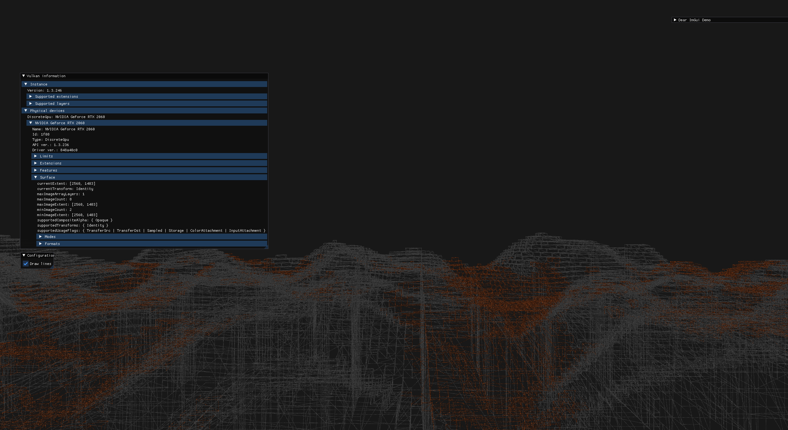
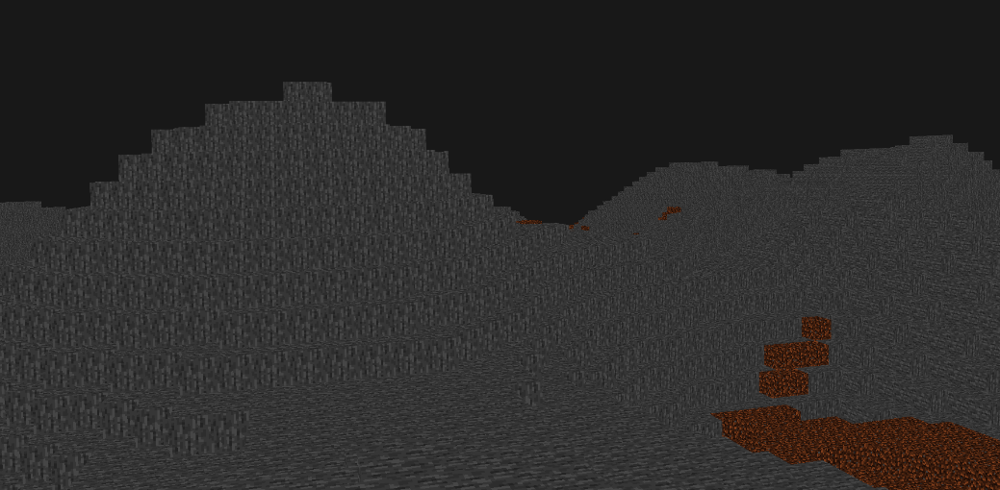

 <pre>
  __  __ _        ____            __ _   
 |  \/  (_)_ __  / ___|_ __ __ _ / _| |_ 
 | |\/| | | '_ \| |   | '__/ _` | |_| __|
 | |  | | | | | | |___| | | (_| |  _| |_ 
 |_|  |_|_|_| |_|\____|_|  \__,_|_|  \__|
</pre>                                         

# MinCraft
## Description

A minimal minecraft-like demo written in C++ using Vulkan API and GLFW.

## Prerequisites

- GPU and driver that supports Vulkan 1.3 and [VulkanHpp](https://github.com/KhronosGroup/Vulkan-Hpp.git) headers
- GLFW 3.3.0
- C++20 capable compiler (tested with at least clang-14.0, gcc-11.3.0)
- GLSL 4.50 capable compiler
- Boost 1.63.0 with program-options
- Cmake 3.15 (and Make)

## Installation
* Clone the repository:
```sh
git clone https://github.com/NikitaDzer/MinCraft.git
 ```

* Compile the project:
```sh
cmake -B build -D CMAKE_BUILD_TYPE=Release 
make -C build
```

## Running
```sh
cd build/

./mincraft --help
# Available options:
#  -h [ --help ]         Print this help message
#  -d [ --debug ]        Use validation layers
#  -u [ --uncap ]        Uncapped fps always

./mincraft --debug # It will take some time to calculate the meshes, so be patient
```

## Examples

* Lines mode render:


* Fill mode render:

