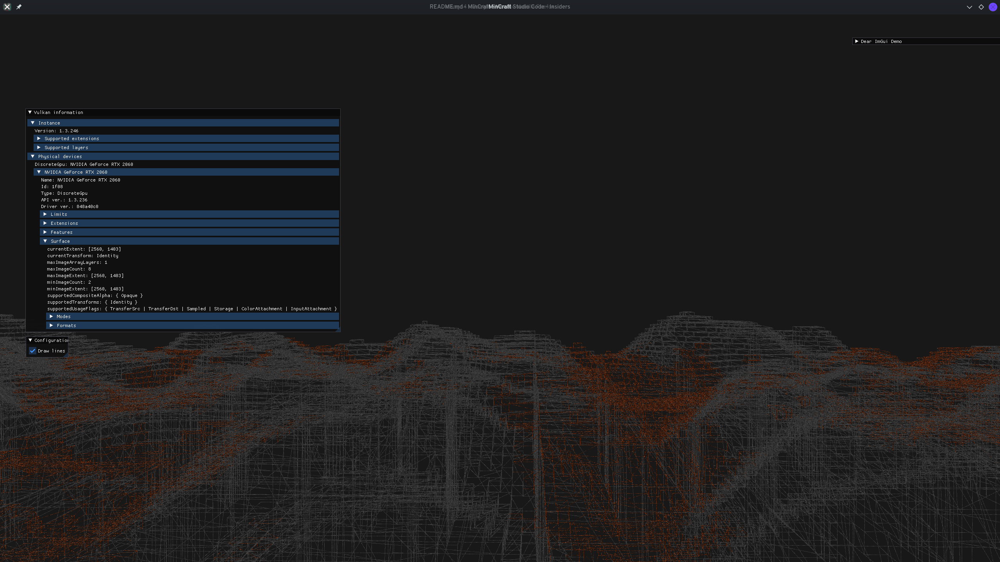

# MinCraft

A minecraft like demo in C++ using Vulkan API.

## 0. Prerequisited

- Cmake 3.15
- C++20 capable compiler (tested with at least clang-14.0, gcc-11.3.0)
- Boost 1.63.0 with program-options
- GLFW 3.3.0
- GPU and driver that supports Vulkan 1.3 and [VulkanHpp](https://github.com/KhronosGroup/Vulkan-Hpp.git) headers

## 1. How to build

### Linux
```sh
mkdir build
cd build
cmake .. -DCMAKE_BUILD_TYPE=Release -GNinja
ninja
```

## 2. How to run
```sh
cd build/

./mincraft --help
# Available options:
#  -h [ --help ]         Print this help message
#  -d [ --debug ]        Use validation layers
#  -u [ --uncap ]        Uncapped fps always

./mincraft --debug # After this some time will take to calculate the meshes, so ge patient
```

